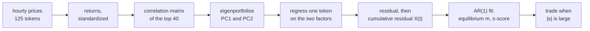
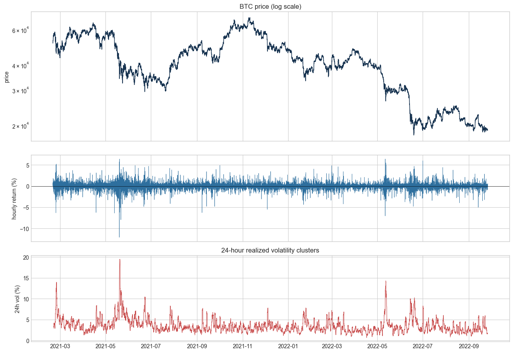
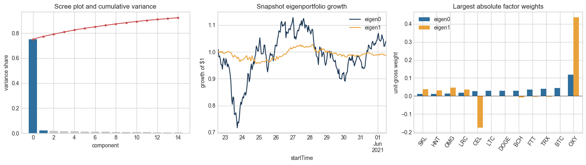
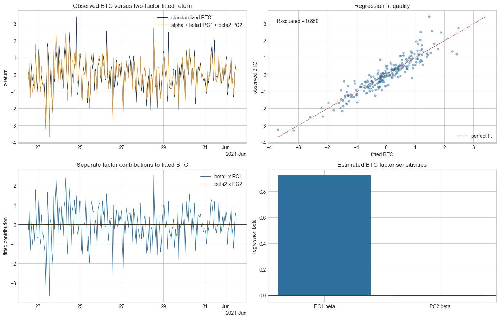
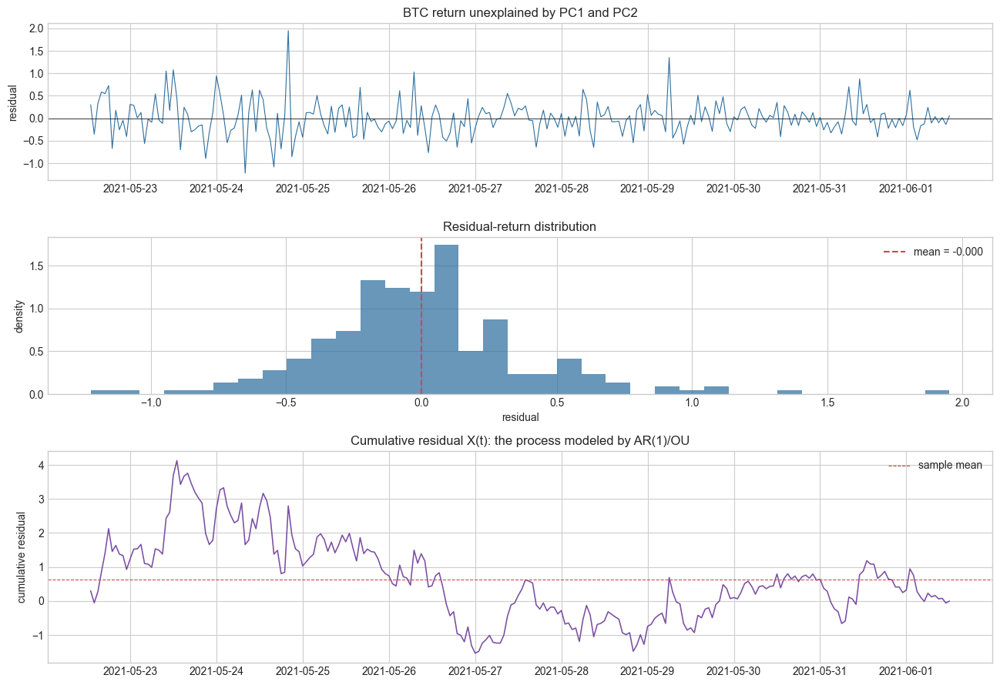
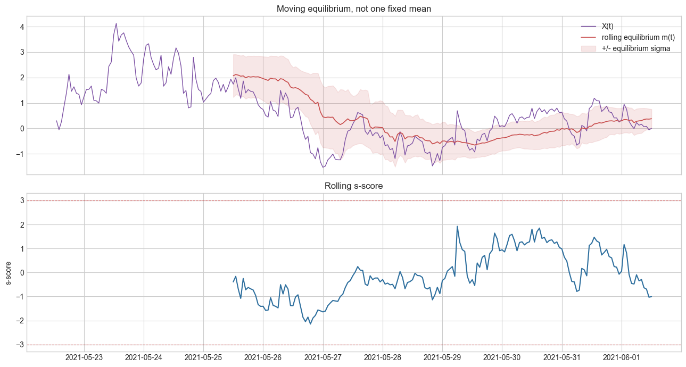
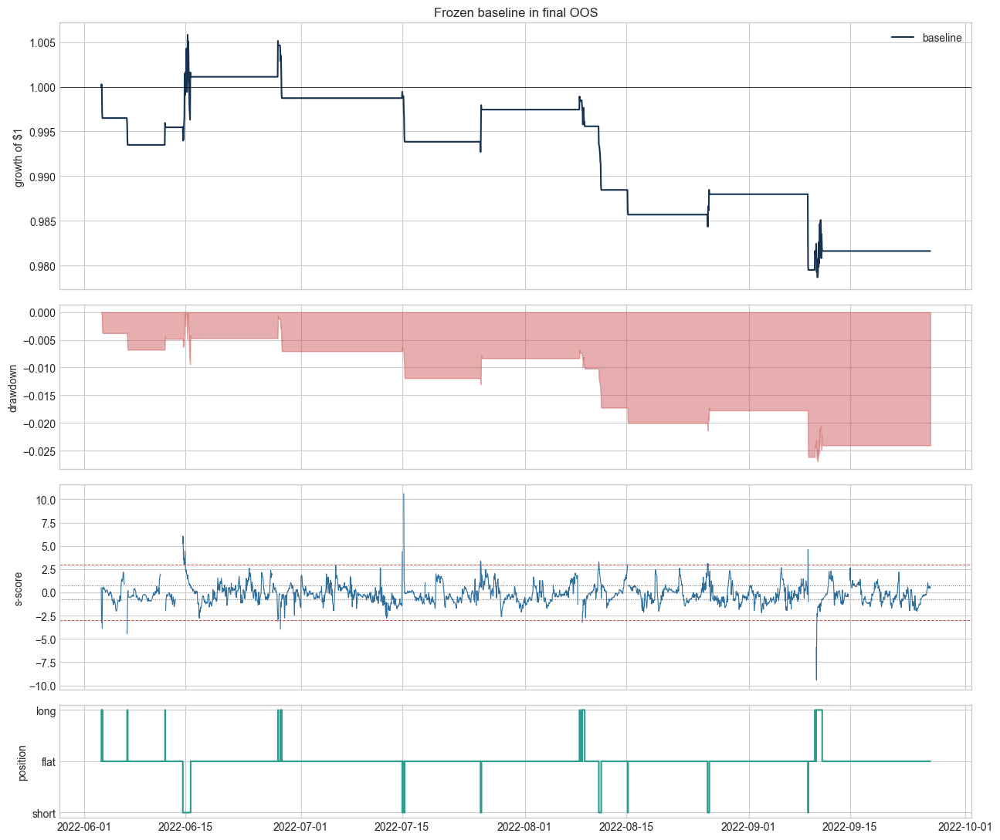

# Crypto Stat Arb

Statistical arbitrage on hourly crypto data, built the way Avellaneda and Lee built it for
equities: strip out the moves that every coin shares, and trade what is left over.

The whole model is in two notebooks and one small Python package. Nothing depends on a
notebook cell having run, and nothing peeks at the future.

- **Data:** 125 tokens, hourly, 2021-02-19 to 2022-09-26 (14,015 hours of FTX prices).
- **Model:** two eigenportfolios, one regression, one AR(1) fit.
- **Result:** it works in the development sample and loses money out of sample. That is the
  interesting part, and the numbers are all below.

---

## The idea in plain language

Crypto is one big trade. When Bitcoin drops 3 percent, almost everything drops with it. On
any given day most of what a token does is just the market happening to it.

So split each token's return into two pieces:

1. **The part everyone shares.** The market move, plus a second, smaller shared move.
2. **The part that is only this token.** The leftover, called the residual.

Piece one is not a trading opportunity. It is beta, and you can buy it with an index.
Piece two is the interesting one. If a token drifts away from where the shared factors say
it should be, and that drift tends to come back, then the drift is a tradable spread.

The strategy is one sentence: **measure the leftover, wait until it stretches unusually far,
bet that it snaps back, and hedge out the shared part while you wait.**

Everything else is machinery for making that sentence precise.



---

## The data



Hourly FTX prices for 125 tokens, plus a file that records which 40 coins were the largest
by market cap at each hour. The universe file matters: the top 40 in March 2021 is not the
top 40 in September 2022, and a model that ignores that is quietly trading a survivorship
bias.

The bottom panel is the reason the next step exists. Volatility comes in bursts. A 1 percent
hourly move in a calm week and a 1 percent move during a crash are not the same event, so
before anything else every return is standardized over its estimation window:

$$Y_i(t) = \frac{R_i(t) - \bar{R}_i}{\bar{\sigma}_i}$$

Now every token is on the same scale and correlations mean what you expect them to mean.

---

## Step 1: find the shared moves



Take the 40 tokens in the universe, take the last 240 hours (10 days) of standardized
returns, and build the correlation matrix. Then take its eigenvectors.

The first eigenvector is the direction all 40 tokens move together. At the snapshot hour
used through the notebook (2021-06-01 12:00) it explains **75.1 percent** of the
cross sectional variance on its own. The second explains another 2.2 percent, for
**77.3 percent** between them. Everything after that is a long flat tail: reaching 90 percent
takes 12 components, and the ones past the second are mostly noise.

That share is not constant. Across the sample it runs from 37 percent in quiet stretches to
81 percent in panics, median 65 percent. When crypto sells off, correlation goes to one, and
the first factor eats everything.

Each eigenvector becomes a portfolio using Avellaneda and Lee's weights:

$$Q_i = \frac{v_i}{\bar{\sigma}_i}$$

Divide by volatility so a quiet coin and a wild coin get comparable risk, then normalize to
unit gross exposure. The middle panel shows what those two portfolios did over the
estimation window. PC1 swings around like the market, because it is the market. PC2 is flat
and small, which is what a second factor should look like.

The right panel shows the weights. PC1 is long every coin. PC2 is a spread:
long OMG, LRC and OXY, short CEL and BCH. That is the model's own opinion about which coins
form a second cluster, and nobody told it to have one.

**This project uses exactly two factors, everywhere, always.** Not "however many reach 90
percent". Two is a choice, and holding it fixed means the residual has a stable meaning
across the whole backtest.

---

## Step 2: subtract the shared part



For one token, regress its standardized returns on the two factor portfolios:

$$Y_i(t) = \alpha_i + \beta_{i,1} F_1(t) + \beta_{i,2} F_2(t) + \varepsilon_i(t)$$

For BTC at the snapshot hour:

| | estimate |
|---|---|
| alpha | 0.0000 |
| beta on PC1 | 0.9220 |
| beta on PC2 | -0.0067 |
| R squared | **0.8501** |

Read that as: 85 percent of what Bitcoin did over those 10 days was the market factor
happening to Bitcoin. Its PC2 loading is essentially zero, which fits, since PC2 is an
altcoin spread and BTC is not in it.

The top left panel is the fitted line drawn over the actual returns, and the two track each
other closely. The bottom left panel splits the fit into its two pieces and makes the point
visually: the PC1 contribution is the whole picture, the PC2 contribution is a flat line
near zero.

What we want is the gap between the blue and orange lines. That gap is the residual.

---

## Step 3: the residual, and its running total



The residual is BTC's return with the two shared factors removed. Its mean is zero by
construction (top and middle panels), and on its own it looks like noise, because it mostly
is.

The trading signal is not the residual. It is the **cumulative residual**, the running sum:

$$X_i(t) = \sum_{s \le t} \varepsilon_i(s)$$

The bottom panel is the object the rest of the model is about. Adding up the residual turns
a jumpy series into a wandering one, and that wandering is what mean reversion is a claim
about. When $X$ is high, BTC has quietly run ahead of what the factors justify. When it is
low, BTC has lagged. The bet is that neither state lasts.

---

## Step 4: how far is far, and does it come back?



Fit an AR(1) to the cumulative residual over a trailing window:

$$X(t+1) = a + b \, X(t) + \zeta(t+1)$$

Three numbers fall out of that one regression:

| quantity | formula | meaning |
|---|---|---|
| equilibrium | $m = a / (1-b)$ | the level $X$ is being pulled toward |
| speed | $\kappa = -\log(b) \cdot 8760$ | how hard it is pulled, per year |
| spread of the pull | $\sigma_{eq} = \sigma_\zeta / \sqrt{1-b^2}$ | how far $X$ normally strays from $m$ |

And then the signal, which is just a z-score in the units the fit provides:

$$s = \frac{X(t) - m}{\sigma_{eq}}$$

At the snapshot hour BTC fits at $b = 0.726$, $m = 0.222$, $\sigma_{eq} = 0.303$, and a
reversion time of roughly 3 hours. The s-score is -0.73, which is not far from equilibrium and
not a trade.

**The detail that matters most is in the chart.** The equilibrium is not one fixed number.
Refit the AR(1) at every hour and $m$ becomes a series (the red line), and it moves a lot: it
walks from about 2.1 down to -0.6 and back over nine days. A model that assumed a single
constant mean would have called the drop on May 26 a huge divergence and shorted into it. The
moving equilibrium calls it what it was, a shift in the resting level, and the s-score in the
bottom panel never quite reaches plus or minus 2.2.

If $b$ lands outside 0 to 1, the fit is not mean reverting, the s-score is thrown away, and
the position goes flat. On the BTC path that check rejects about 6 percent of all hourly fits.

---

## Step 5: trading it, honestly



The backtest is walk forward, one bar at a time, with the timing kept strict:

- The factor model at hour `t` is estimated on data through `t-1` only.
- That model produces the residual at `t`, and the rolling AR(1) produces the s-score at `t`.
- The position is applied to the return at `t+1`. No signal is ever traded at the price that
  generated it.
- The traded instrument is the token minus its fitted factor exposure, at unit gross, so the
  shared move is hedged out rather than ridden.
- Turnover is charged 5 basis points, including the cost of rebalancing the hedge as the
  factor weights drift.

That last set of choices matters more than it sounds. Fit an in-sample OLS residual over a
window and its cumulative path is pinned to zero at both ends by construction, which hands a
backtest free money. Building the residual one step at a time removes that.

**Rules:** enter when the s-score crosses the entry threshold (short if positive, long if
negative), exit when it comes back inside the exit threshold, stay flat whenever the AR(1)
is not stationary.

### Splitting the data

After the 240 hour warmup there are 13,774 usable bars. The first 80 percent (11,019 bars,
through 2022-06-03) is the development segment. The last 20 percent (2,755 bars) is not
touched until the parameters are frozen.

On development only, the AR window is picked by net Sharpe from a 10 value grid, then entry
and exit are picked from a 40 cell grid (39 of those cells traded often enough to count).
Those three numbers are then frozen and run once on the held out fifth.

### Results

BTC, selected on development: 72 hour AR window, enter at 3.0, exit at 0.75.

| | development (80%) | out of sample (20%) |
|---|---|---|
| total return | +2.75% | **-1.84%** |
| annualized return | +2.19% | -5.73% |
| annualized volatility | 5.36% | 3.60% |
| Sharpe | **+0.43** | **-1.62** |
| max drawdown | -4.48% | -2.70% |
| closed trades | 121 | 19 |
| win rate | 58.7% | 47.4% |
| time in the market | 6.5% | 3.3% |

DOGE, same pipeline, selected separately: 18 hour AR window, enter at 2.5, exit at 0.0.

| | development (80%) | out of sample (20%) |
|---|---|---|
| total return | +29.69% | **-5.65%** |
| Sharpe | **+1.11** | **-2.25** |
| max drawdown | -19.43% | -6.99% |
| closed trades | 191 | 52 |
| win rate | 50.3% | 36.5% |

The chart above is the BTC out of sample run. Equity ends at 0.982, the drawdown grinds down
all quarter, and the position panel shows how rarely a 3.0 threshold actually fires: 19
trades in four months.

### Reading that honestly

Both tokens look fine in development and both lose money out of sample. The tuning files
show why, and they were worth keeping in the repo:

- On BTC's entry and exit grid, **only 6 of the 39 usable settings had positive development
  Sharpe**, and all six sit at the two widest entry thresholds. That is not a strategy with a
  parameter, it is a grid with one good corner.
- At the default entry of 2.0 and exit of 0.5, **every single one of the 10 AR windows was
  negative** on development. The search picked 72 hours because it was the least bad, not
  because it was good.
- DOGE looks healthier (25 of 39 cells positive) and still flips negative out of sample,
  which points at a regime that ended rather than an edge that was found.

The out of sample window (June to September 2022) is also the post-Terra crypto bear market,
when correlation was pinned near one. Exactly the conditions where PC1 eats everything and
there is very little idiosyncratic residual left to trade.

The honest summary: **the pipeline is correct and the signal is not profitable on this data.**
Getting a walk forward backtest to say that clearly, instead of producing a beautiful curve
built on look ahead, is what the code is for.

---

## Try it

```bash
git clone https://github.com/AnirudhJM24/Crypto-Stat-Arb.git
cd Crypto-Stat-Arb
pip install numpy pandas matplotlib jupyter
```

Start with the notebooks:

| notebook | what it covers |
|---|---|
| [`explore.ipynb`](explore.ipynb) | Every step built from scratch on one factor, with the plotting helpers written out inline. Read this first if you want to see the mechanics. |
| [`btc_two_factor_pipeline.ipynb`](btc_two_factor_pipeline.ipynb) | The full two factor model in order, ending in the tuned walk forward backtest. This is the notebook the charts above come from. |

Or use the library:

```python
from statarb import Market, analyze_token, backtest_token

market = Market.load("data")

analysis = analyze_token(
    market, "BTC", when="2021-06-01 12:00",
    estimation_window=240, n_factors=2, ar_window=20,
)
analysis.regression          # alpha, both betas, R squared
analysis.cumulative_residual # X(t)
analysis.ar1.to_series()     # b, m, sigma_eq, reversion time, s-score

# refits the factor model every hour, about a minute for this span
test = backtest_token(
    market, "BTC", start="2022-06-03 08:00", end="2022-09-26 03:00",
    estimation_window=240, n_factors=2, ar_window=72,
    entry=3.0, exit=0.75, cost_bps=5.0,
)
test.metrics
test.trades
```

Or draw the charts from the terminal:

```bash
python -m statarb spectrum                        # eigenvalue scree plot and table
python -m statarb eigenpf -c 0                    # the PC1 eigenportfolio
python -m statarb compare -a SOL --threshold 1.5  # token vs factor, red where they separate
python -m statarb divergence -a SOL               # divergence distribution and stats
python -m statarb cumresiduals -a BTC ETH         # cumulative residuals
```

Shared options: `-w/--when` for the window end, `-n/--window` for its length in hours,
`-c/--component`, `--data-dir`, `--save out.png`.

---

## What is in the repo

```
statarb/
  data.py         Market: prices, returns, hourly top-40 universe, window slicing
  standardize.py  standardize(), portfolio_returns(), standardized_panel()
  eigen.py        correlation_matrix(), decompose(), eigen_portfolio()
  residuals.py    fit_residuals() -> residuals, betas, R squared, z-scores
  divergence.py   divergence(), divergence_stats(), separation_mask()
  ar1.py          fit_ar1(), residual_ar1(), rolling_ar1()
  backtest.py     walk forward backtest, AR window search, threshold search
  pipeline.py     ordered eigen -> residual -> AR(1) -> backtest analysis
  plots.py        the six views, each returning a matplotlib Axes
  cli.py          python -m statarb <view>

data/
  coin_all_prices_full.csv          hourly prices, 125 tokens
  coin_universe_150K_40.csv         top 40 by market cap at each hour
  *_two_factor_residual_path.csv    cached walk forward residuals
  *_two_factor_ar_window_search.csv AR window grid, development segment only
  *_two_factor_threshold_search.csv entry and exit grid, development segment only
  *_two_factor_tuning.json          the frozen parameters

reports/project_assets/             the charts used above
```

Every function takes a `Market` explicitly. There are no globals and no hidden state, so
anything in the notebooks can be lifted straight into a script.

---

## Caveats

This is a study, not a trading system. The sample is 19 months of one exchange that no
longer exists. Costs are a flat 5 basis points on turnover, with no slippage, no borrow
cost, no funding, and no capacity limit. Positions are unit gross with no sizing or risk
model. The out of sample segment is a single 4 month window, so its Sharpe has a wide error
bar of its own.

## Reference

Marco Avellaneda and Jeong-Hyun Lee, *Statistical Arbitrage in the U.S. Equities Market*,
Quantitative Finance, 2010. The eigenportfolio construction, the cumulative residual, the
OU fit and the s-score all come from that paper. What is new here is applying it to hourly
crypto with a time varying universe, and being strict about the walk forward split.
